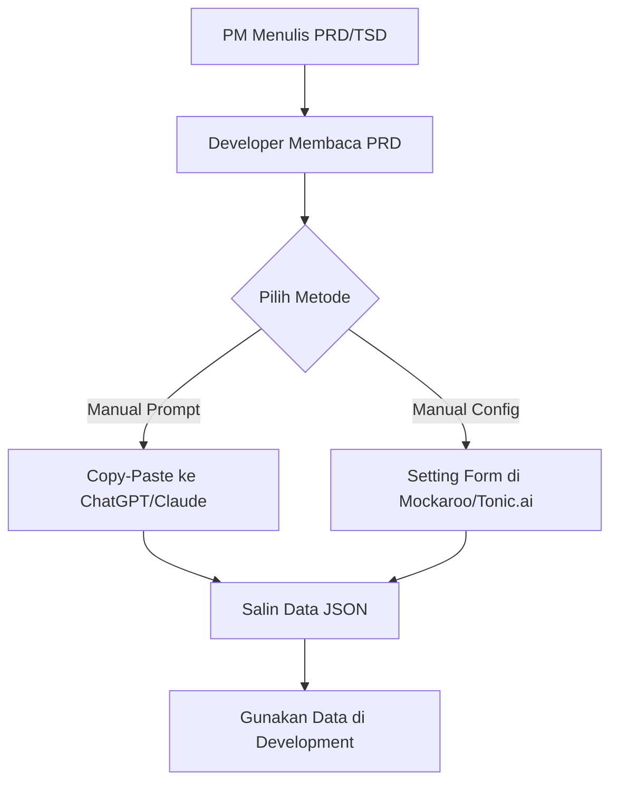
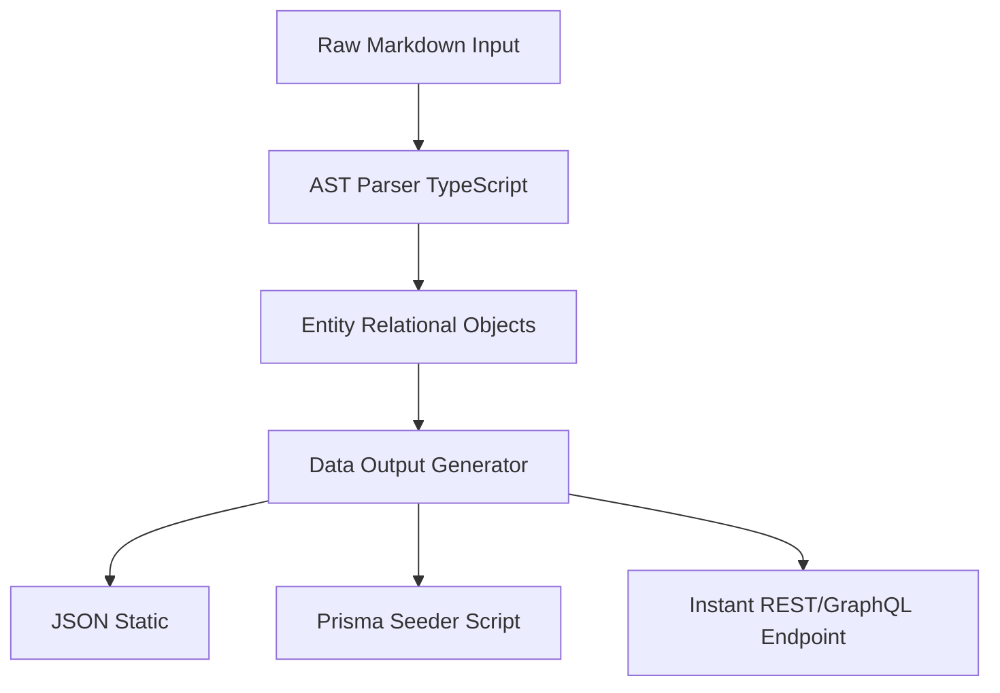
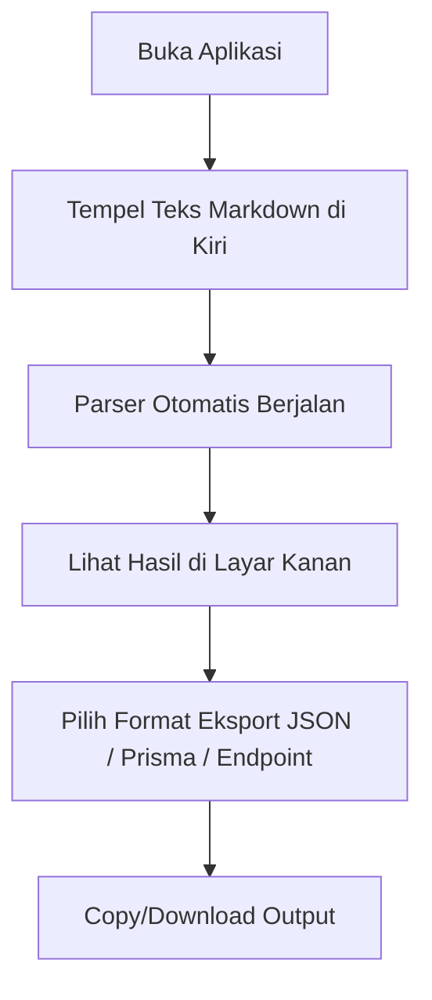
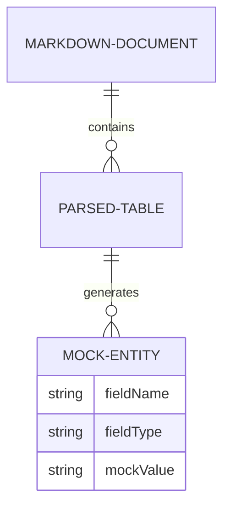

# Product Requirements Document (PRD): Mock Data Generator

## 1. Executive Summary
- **Problem Statement:** Terdapat _bottleneck_ operasional antara penyusunan dokumen _requirement_ (seperti PRD, TSD, BRD) dan kesiapan data tiruan (mock data) untuk tahap desain serta _development_. Saat ini, pengembang sering kali harus melakukan pekerjaan manual seperti _copy-paste prompt_ ke LLM atau menggunakan form manual di generator seperti Mockaroo.
- **Proposed Solution:** Membangun aplikasi MVP pembuat data tiruan otomatis (Mock Data Generator) yang mampu mengekstrak variabel dan struktur relasional langsung dari dokumen spesifikasi berbasis Markdown.
- **Expected Impact:** Mengotomatisasi alur kerja _developer_ dan desainer dalam menyiapkan data, menghilangkan kerja manual penyusunan form, dan menyediakan data terstruktur yang langsung dapat digunakan.

## 2. Product Vision & Objectives
- **Product Vision:** Menjadi solusi standar yang menjembatani kesenjangan antara dokumentasi produk dengan kebutuhan data _development_, mempercepat waktu pengembangan produk digital.
- **Business Objectives:**

| Business Objective | Success Metric / KPI | Target | Baseline | Timeline |
| :--- | :--- | :--- | :--- | :--- |
| Mengurangi waktu setup data dev | Waktu rata-rata pembuatan mock data per fitur | < 10 Menit | ~60 Menit | Q1 Release |
| Adopsi pengguna internal | Jumlah dokumen spesifikasi yang diproses | 100 Dokumen | 0 | 1 Bulan post-launch |

- **Alignment dengan Strategi Perusahaan:** Meningkatkan produktivitas tim _engineering_ dan desain, sehingga _time-to-market_ produk-produk perusahaan menjadi lebih cepat.

## 3. Target Users & Personas

| Role | Deskripsi | Goals | Pain Points | Tech Savviness | Frequency of Use |
| :--- | :--- | :--- | :--- | :--- | :--- |
| Developer (Maker) | Software/Frontend/Backend Engineer | Mendapatkan mock data yang sesuai dengan spesifikasi PRD secepat mungkin | Membuang waktu membuat _seeder_ manual atau _prompting_ LLM | High | Daily |
| UI/UX Designer (Maker) | Desainer antarmuka | Membutuhkan data JSON instan untuk diisi ke dalam desain/prototipe UI | Kesulitan membuat variasi data tiruan yang realistis secara cepat | Medium | Weekly |
| Product Manager (Reviewer) | Penulis dokumen spesifikasi | Memastikan dokumen Markdown yang ditulis kompatibel dan jelas | Tidak punya waktu validasi data tiruan dev secara manual | Medium | Weekly |

## 4. Scope

- **In-Scope:**
| Fitur | Keterangan |
| :--- | :--- |
| Markdown Parser | Parser berbasis AST (Abstract Syntax Tree) di TypeScript untuk tabel Markdown. |
| Split-Screen UI | Antarmuka _real-time_; input Markdown di kiri, _preview_ data di kanan. |
| Format Output: JSON | Menghasilkan JSON statis untuk diunduh/salin. |
| Format Output: Prisma | Menghasilkan ekstensi _script seeder_ untuk Prisma ORM. |
| Mock API Endpoints | _Endpoint_ REST/GraphQL instan dari backend _service_ (ElysiaJS on Bun). |

- **Out-of-Scope:**
| Fitur | Alasan Pengecualian | Potensi Fase Berikutnya |
| :--- | :--- | :--- |
| Ekstraksi PDF / Word | Fokus MVP hanya pada format Markdown karena tersetruktur secara hierarkis dan ringan. | Fase 2 |
| Enterprise RBAC | MVP tidak memerlukan manajemen akses pengguna tingkat lanjut. | Fase 3 |

## 5. Stakeholders

| Role | Interest | Influence | Communication Frequency |
| :--- | :--- | :--- | :--- |
| Engineering Lead | High | High | Bi-Weekly |
| Design Lead | High | Medium | Bi-Weekly |
| Product Team | Medium | High | Monthly |

## 6. Current State (As-Is)

- **Proses Saat Ini:**

- **Pain Points:**
| Pain Point | Dampak ke User/Bisnis | Severity |
| :--- | :--- | :--- |
| _Prompting_ manual berulang | Kehilangan waktu _development_ yang berharga | High |
| Inakurasi struktur data | _Bug_ integrasi karena data tiruan tidak sesuai dengan spesifikasi asli | High |

- **Sistem Existing yang Terdampak:** N/A (Produk Baru)

## 7. Proposed Solution (To-Be)

- **Solution Overview:** Aplikasi web berbasis arsitektur Monorepo (Svelte 5 + Vite SPA di frontend dan ElysiaJS on Bun di backend) dengan antarmuka _split-screen_ yang secara instan menerjemahkan struktur tabel dalam Markdown menjadi _mock data_ JSON atau kode _seeder_ Prisma menggunakan parser AST.
- **Key Differentiators:** Otomatisasi alur kerja yang sangat spesifik untuk _developer_ dan desainer, tanpa antarmuka penyusunan _form_ manual sama sekali.
- **Solution Architecture (High-Level):**

## 8. Gap Analysis

| Area | Current State | Desired State | Gap | Priority MoSCoW |
| :--- | :--- | :--- | :--- | :--- |
| Ekstraksi Spesifikasi | Pembacaan manual | Ekstraksi otomatis dari tabel Markdown | Mesin Parser AST | Must Have |
| _Generation_ Data | _Config_ UI / Prompting | Instan tanpa _config_ tambahan | Data Mapper terotomatisasi | Must Have |

## 9. Feature Requirements

- **Feature List & Prioritization:**
| Feature ID | Feature Name | Deskripsi Singkat | Priority | Epic | Target Release |
| :--- | :--- | :--- | :--- | :--- | :--- |
| F-01 | Split-Screen Editor | Editor markdown dan preview UI. | Must Have | Core UI | MVP |
| F-02 | AST Table Parser | Parser TypeScript untuk ekstrak data entitas dari teks. | Must Have | Core Logic | MVP |
| F-03 | JSON Exporter | Tombol ekspor hasil data ke JSON. | Must Have | Exporter | MVP |
| F-04 | Prisma Seeder | Ekspor _script seed_ untuk Prisma. | Should Have | Exporter | MVP |
| F-05 | Instant API Route | Pembuatan Mock API _endpoint_. | Could Have | Integration | MVP / V1 |

- **User Stories:**
  - Sebagai **Developer**, Saya ingin **memasukkan struktur PRD Markdown ke editor kiri**, Sehingga **saya bisa langsung melihat JSON yang sesuai dengan _requirement_ di sebelah kanan**.
    - _Acceptance Criteria:_ Input Markdown berisi tabel entitas secara otomatis ter-render menjadi array of JSON objects dengan panjang 10 row data _dummy_ yang relevan.

## 10. Non-Functional Requirements (ISO 25010)

| Kategori | Requirement | Pengukuran/Target | Priority |
| :--- | :--- | :--- | :--- |
| Performance | Eksekusi AST Parser dan generasi data tiruan | < 1 detik untuk ukuran teks < 5MB | High |
| Usability | Akses antarmuka | Berjalan mulus pada _desktop browser_ dengan _split-screen layout_ | High |
| Maintainability | Kode aplikasi Svelte 5 & ElysiaJS | _Clean code_ dengan tipe TypeScript yang ketat di dalam Bun workspace | Medium |

## 11. User Flow & Process Model

- **Primary User Flow:**

- **Alternative / Exception Flows:**
| Trigger | Deskripsi | Handling |
| :--- | :--- | :--- |
| Markdown salah format | Tabel tidak valid atau tidak memiliki _header_ | Munculkan notifikasi (_toast_) "Tabel Markdown tidak valid". Tampilkan struktur contoh. |

## 12. Wireframes & UI/UX Specification

- **Design Principles:** Mengadopsi pendekatan **shadcn/ui**. Bergaya _clean_, minimalis, fungsional dan profesional. Memanfaatkan _rounded edges_ (sudut membulat) dan tipografi modern (seperti Inter atau Geist) untuk kesan premium.
- **Key Screens:**
| Screen ID | Screen Name | Deskripsi | Link Wireframe/Mockup |
| :--- | :--- | :--- | :--- |
| S-01 | Main Workspace | Antarmuka _split-screen_, input di kiri dan preview interaktif di kanan. | TBD |

- **Design Specifications:**
| Aspek | Spesifikasi |
| :--- | :--- |
| UI Framework | Svelte 5 + TailwindCSS (Sistem Sudut Membulat / No Sharp Corners) |
| Color Palette | Monokromatik gelap (Neutral Dark `#09090b`) dengan aksen _indigo/violet_ modern. Support _Dark Mode by Default_. |
| Typography | Sans-serif modern (Geist Sans / Inter), monospace berlekuk lembut (JetBrains Mono) untuk blok kode. |

## 13. Data Requirements

- **Data Model (High-Level):**

## 14. Integration & API Requirements

| System/Service | Direction | Protocol | Data Format | Auth Method | SLA |
| :--- | :--- | :--- | :--- | :--- | :--- |
| Instant Mock Route | Outbound | HTTP/REST, GraphQL | JSON | None (Public on MVP) | > 99% Uptime (Stateless ElysiaJS on Bun) |

## 15. Analytics & Metrics

| Metric Name | Deskripsi | Target | Metrik Pengukuran | Frekuensi |
| :--- | :--- | :--- | :--- | :--- |
| Parsing Success Rate | Persentase teks markdown yang sukses diproses AST | > 95% | Internal Logging | Daily |
| Export Count | Jumlah klik tombol salin/unduh hasil | > 50 per hari | Event Tracking | Weekly |

## 16. Assumptions & Constraints

- **Assumptions:**
| Assumption | Risk if Wrong | Validated By | Status |
| :--- | :--- | :--- | :--- |
| Dokumen produk umumnya menggunakan Markdown (Notion, Obsidian, Jira). | Target _user_ akan sulit mengadopsi _tool_ ini. | Survei Internal Tim | Open |

- **Constraints:**
| Constraint | Tipe | Dampak |
| :--- | :--- | :--- |
| Kapasitas Tim (3 Orang) | Resource | Pengembang _interface_, _logic_ dan integrasi dijalankan paralel, sehingga lingkup MVP wajib dirampingkan secara ketat. |

## 17. Dependencies

| Dependency | Tipe | Owner/PIC | Expected Resolution Date | Dampak jika Tidak Terpenuhi |
| :--- | :--- | :--- | :--- | :--- |
| TypeScript AST Parser (Remark/Unified.js) | Library | Engineering | MVP Start | Gagal memparsing input dengan akurat. |

## 18. Risks & Mitigations

| Deskripsi Risiko | Probability | Impact | Risk Score | Strategi Mitigasi | Owner |
| :--- | :--- | :--- | :--- | :--- | :--- |
| Ketidaksesuaian interpretasi tipe data oleh parser (misal: membedakan ID vs String biasa). | High | High | 9 | Implementasi _fuzzy matching_ pada nama kolom tabel markdown dan penyediaan opsi override manual UI. | Engineering |

## 19. Release Strategy

- **Release Plan:**
| Fase | Tujuan |
| :--- | :--- |
| MVP | Solusi berbasis Web dengan JSON & Prisma export. |
| V1.0 | Dukungan GraphQL dan _persistence_ session penyimpanan lokal. |

- **Rollout Strategy:** _Internal Beta Release_ ke tim _engineering_ perusahaan.
- **Go-Live Checklist:**
  - [ ] _Unit testing_ pada Markdown AST Parser (mencakup edge cases).
  - [ ] Implementasi desain _split-screen_ dengan _soft rounded corners_.
  - [ ] _Deployment_ MVP frontend pada Vercel/Cloudflare Pages & API pada Bun runtime.

## 20. Acceptance Criteria & Definition of Done

- **Product-Level Acceptance Criteria:** Pengguna dapat menempelkan teks Markdown berisi tabel spesifikasi ke dalam aplikasi, dan dalam waktu kurang dari 1 detik mendapatkan hasil _dummy data_ dalam format JSON yang bisa langsung di-copy.
- **Definition of Done:** Kode telah melalui _code review_, diuji tanpa _error_ kritikal di _environment staging_, dan siap di-_deploy_.

## 21. Open Questions

| ID | Pertanyaan | Diajukan Oleh | Assigned To | Status |
| :--- | :--- | :--- | :--- | :--- |
| Q1 | Format output Prisma spesifik menggunakan versi Prisma keberapa? | Product | Engineering | Open (Default: Prisma v5+) |
| Q2 | Apakah diperlukan otentikasi (login) untuk menggunakan versi MVP ini? | Product | Stakeholders | Resolved (Tidak. MVP adalah 100% Client-Side / Ephemeral Guest Tool) |

## 22. Approval & Sign-off

| Name | Role | Signature | Date | Decision |
| :--- | :--- | :--- | :--- | :--- |
| [TBD] | Product Lead | | | Pending |
| [TBD] | Engineering Lead | | | Pending |
