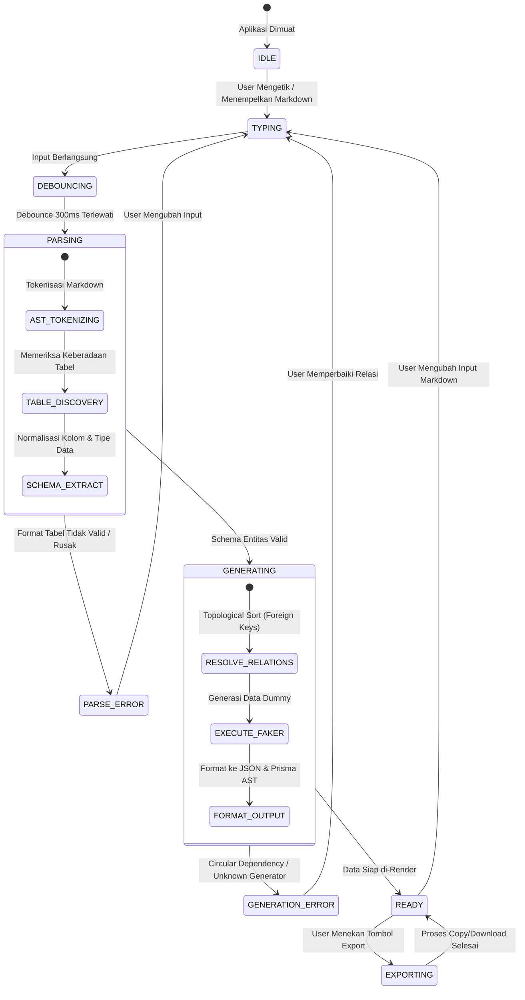
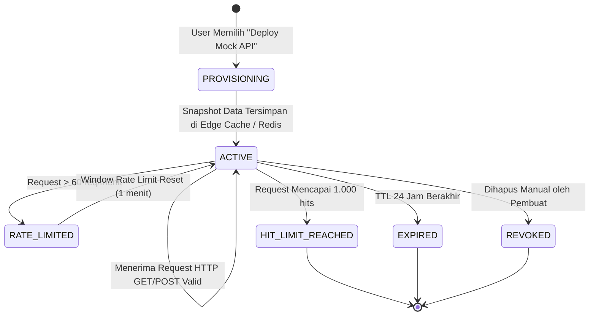

# State & Status Flow: Mock Data Generator

## 1. Overview
Dokumen ini mendokumentasikan mesin keadaan (*finite state machine*) untuk dua modul utama pada sistem Mock Data Generator:
1. **Siklus Pemrosesan Editor & AST Parser (Client-Side State)**
2. **Siklus Hidup Endpoint Mock Instan (Server/Edge State)**

---

## 2. Editor & AST Parser State Machine

### Tabel Transisi State Editor

| State Awal | Event / Trigger | State Tujuan | Aksi / Efek Samping |
| :--- | :--- | :--- | :--- |
| `IDLE` | User menginput teks | `TYPING` | Menampilkan indikator input aktif |
| `TYPING` | Jeda ketik 300ms | `PARSING` | Mengirim payload ke Web Worker AST |
| `PARSING` | Syntax table invalid | `PARSE_ERROR` | Tampilkan inline lint warning di editor |
| `PARSING` | Syntax valid | `GENERATING` | Ekstrak tipe kolom dan jalankan Faker engine |
| `GENERATING` | Data siap | `READY` | Render tabel interaktif dan JSON tree preview |
| `READY` | Klik "Export JSON" | `EXPORTING` | Salin teks ke navigator clipboard |

---

## 3. Instant Mock Endpoint Lifecycle

### Tabel Transisi State Mock Endpoint

| State Awal | Trigger | State Akhir | HTTP Response Code |
| :--- | :--- | :--- | :--- |
| `PROVISIONING` | Payload valid disimpan ke KV | `ACTIVE` | `201 Created` |
| `ACTIVE` | Request masuk (normal) | `ACTIVE` | `200 OK` (dengan Header `X-Mock-TTL`) |
| `ACTIVE` | Melebihi kuota 60 req/menit | `RATE_LIMITED` | `429 Too Many Requests` |
| `ACTIVE` | Waktu > 24 jam sejak deploy | `EXPIRED` | `410 Gone` |
| `ACTIVE` | Total request = 1.000 | `HIT_LIMIT_REACHED` | `410 Gone` |
| `ACTIVE` | User menghapus endpoint | `REVOKED` | `404 Not Found` |
