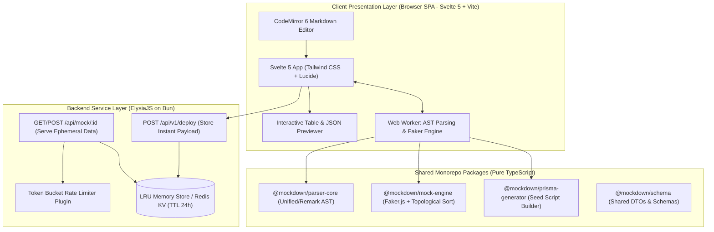

# System Architecture: Mockdown

## 1. Executive Summary
Mockdown dirancang menggunakan arsitektur **Decoupled Edge-Ready Monorepo**. Desain arsitektur ini memisahkan secara tegas antara antarmuka pengguna frontend (*Pure Client SPA*), layanan backend instan (*ElysiaJS on Bun*), dan mesin inti komputasi data (*Core Domain Packages*), memastikan latensi parsing < 1 detik, rendering 60 FPS, dan nol biaya server untuk komputasi parsing data.

---

## 2. High-Level Architecture Diagram

---

## 3. Component Breakdown

### 3.1. Client-Side Presentation Layer (`apps/web`)
* **Svelte 5 + Vite (SPA):** Aplikasi *Single Page Application* murni tanpa overhead server-side rendering, memanfaatkan Svelte 5 *Runes* untuk state management yang reaktif dan cepat.
* **CodeMirror 6 Editor:** Editor kode ringan (~300 KB) dengan dukungan GFM syntax highlighting dan line markers.
* **Dedicated Web Worker:** Menjalankan `@mockdown/parser-core` dan `@mockdown/mock-engine` di thread latar belakang (*background thread*) agar browser pengguna tidak membeku (*zero UI freeze*).

### 3.2. Backend API Service (`apps/api`)
* **ElysiaJS (Bun Native):** Server HTTP berkecepatan tinggi untuk menangani pembuatan dan penyajian data endpoint instan (`/api/mock/:id`).
* **In-Memory LRU / Redis Store:** Penyimpanan *volatile* ber-TTL 24 jam dengan auto-purge untuk memastikan data mock kedaluwarsa dibersihkan secara otomatis.
* **Rate Limiting Middleware:** Melindungi server dari DoS dengan membatasi request maksimal 60 req/menit per IP.

### 3.3. Core Domain Packages (`packages/*`)
* **`@mockdown/parser-core`:** Menerjemahkan tabel Markdown menjadi AST dan mengekstrak definisi kolom.
* **`@mockdown/mock-engine`:** Membangun data sintetis (@faker-js/faker) dan menyelesaikan relasi *foreign key* antar entitas.
* **`@mockdown/prisma-generator`:** Mengonversi data entitas menjadi skrip seeder Prisma (`seed.ts`).
* **`@mockdown/schema`:** Definisi tipe data bersama dan validasi runtime.

---

## 4. Latency & Performance SLA
* **Client AST Parsing:** $\le 100\text{ ms}$ di dalam Web Worker.
* **Client Faker Generation (10-100 rows):** $\le 150\text{ ms}$.
* **Total Time-to-Preview:** $\le 550\text{ ms}$ (Debounce 300ms + Parse/Gen 250ms).
* **Mock Endpoint Response Time (Bun + Elysia):** $\le 5\text{ ms}$ (P95 Latency).
