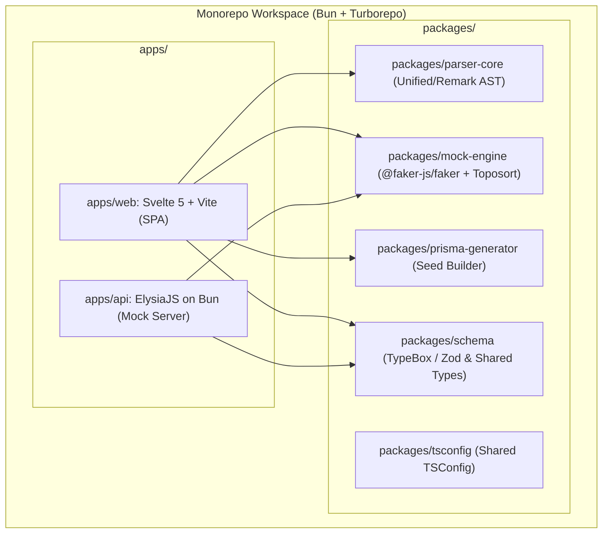

# Technology Stack Document: Mockdown

## 1. Executive Summary
Dokumen ini menetapkan standar dan spesifikasi arsitektur teknologi (*Tech Stack*) untuk **Mockdown**. Sistem ini dibangun dengan arsitektur **Decoupled Monorepo** berbasis **Bun runtime**, memisahkan secara tegas antara **Frontend SPA (Svelte + Vite)**, **Backend API (ElysiaJS)**, dan **Core Logic Packages** (Parser AST & Faker Engine).

---

## 2. Technology Stack Matrix

### 2.1. Core Runtime & Monorepo Tooling
* **Runtime & Package Manager:** **Bun (v1.1+)**
  * Eksekusi TypeScript native tanpa *transpile overhead*.
  * Manajemen dependensi workspace super cepat.
  * Test runner bawaan (`bun test`).
* **Monorepo Build Orchestration:** **Turborepo**
  * *Pipeline caching* untuk linting, typecheck, dan unit testing antar-package.

---

### 2.2. Frontend Application (`apps/web`)
* **Framework:** **Svelte 5 + Vite**
  * Dipilih sebagai **Single Page Application (SPA)** murni untuk rendering instan, reaktivitas reaktif (*runes*), dan nol biaya server untuk UI.
* **Markdown Code Editor:** **CodeMirror 6**
  * Ekstrem ringan (~300 KB), performa tinggi, mendukung *GitHub Flavored Markdown (GFM)*, line numbers, dan custom dark themes.
* **Worker Isolation:** **Native Web Worker**
  * Menjalankan parsing AST dan pembuatan data dummy di background thread agar UI tetap responsif 60 FPS pada dokumen besar.
* **Styling & Icons:** **Tailwind CSS + Lucide Icons (Svelte)**
  * Sistem utilitas CSS modern untuk menerapkan prinsip *soft rounded curves* dan *glassmorphism*.

---

### 2.3. Backend API Service (`apps/api`)
* **Framework:** **ElysiaJS (Bun Native Framework)**
  * Framework backend tercepat di ekosistem JavaScript/TypeScript dengan latensi ultra-rendah (<5ms) dan konsumsi memori minim.
  * Fitur utama: Validasi tipe data ketat menggunakan TypeBox/Elysia schema, rate limiter, dan CORS plugin.
* **Instant Mock Storage:** **In-Memory LRU Cache with TTL (Local / Bun)** & **Upstash Redis (Production)**
  * Menyimpan payload data mock untuk endpoint instan `/api/mock/:id` dengan masa kedaluwarsa tegas 24 jam.

---

### 2.4. Core Packages (`packages/*`)
* **`@mockdown/parser-core`:**
  * Dibangun menggunakan **Unified.js**, **Remark-Parse**, dan **Remark-GFM**.
  * Bertugas mengubah tabel Markdown menjadi *Abstract Syntax Tree (AST)* dan mengekstrak definisi kolom serta tipe semantik.
* **`@mockdown/mock-engine`:**
  * Menggunakan **`@faker-js/faker`**.
  * Dilengkapi algoritma **Topological Sort (Kahn's Algorithm)** untuk menyelesaikan urutan ketergantungan relasi *Foreign Key* antar tabel.
* **`@mockdown/prisma-generator`:**
  * Menerjemahkan struktur entitas data menjadi template kode TypeScript `seed.ts` yang kompatibel dengan Prisma ORM.
* **`@mockdown/schema`:**
  * Menampung kontrak tipe data bersama (*shared TypeScript interfaces & DTO schemas*) antara `apps/web` dan `apps/api`.

---

## 3. Infrastructure & Deployment Target

| Komponen | Target Deployment | Protokol / Port |
| :--- | :--- | :--- |
| **`apps/web` (Frontend)** | Vercel Static / Cloudflare Pages / Netlify | HTTPS / Port 443 |
| **`apps/api` (Backend)** | Fly.io / Railway / Render (Bun Container) | HTTP/REST / Port 3000 |
| **Local Development** | `bun dev` (Turborepo paralel: Web: 5173, API: 3000) | `http://localhost:5173` |
