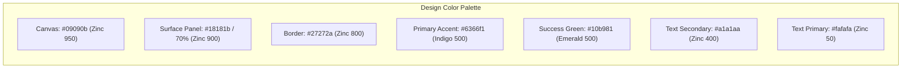

# UI/UX Specification: Mockdown

## 1. Design Philosophy & Aesthetic Guidelines
Mockdown mengusung estetika **Modern Developer-First Tooling** yang terinspirasi oleh standar visual premium seperti *Linear*, *Ray.so*, dan *v0.dev*. 

Prinsip desain utama:
1. **NO SHARP CORNERS (Anti Sudut Tajam):** Seluruh elemen visual wajib memiliki lengkungan sudut yang lembut (*soft rounded curves*) untuk memberikan nuansa antarmuka yang ramah, bersih, dan modern.
2. **High-Contrast Dark Mode by Default:** Menggunakan palet netral gelap yang nyaman di mata developer saat bekerja berjam-jam.
3. **Fluid Micro-Interactions:** Setiap interaksi pengguna (mengetik, menyalin, beralih tab) disertai umpan balik visual instan.
4. **Instant Split-Screen Ergonomics:** Antarmuka fokus tanpa distraksi; input di sisi kiri dan output ter-render *real-time* di sisi kanan.

---

## 2. Radius System (Sistem Sudut Membulat)

Semua komponen UI wajib mematuhi aturan hierarki *border radius* berikut:

| Kategori Elemen | Tailwind Class | Nilai Radius | Contoh Penggunaan |
| :--- | :--- | :--- | :--- |
| **Main Containers & Split Panes** | `rounded-2xl` / `rounded-3xl` | 16px – 24px | Frame editor kiri, frame preview kanan, modal dialog besar. |
| **Cards, Code Panels & Tab Surfaces** | `rounded-xl` | 12px | Code block container, preview table wrapper, notification box. |
| **Interactive Elements (Buttons, Inputs)**| `rounded-lg` | 8px – 10px | Tombol aksi, input field jumlah row, tab buttons. |
| **Pills, Badges & Toggles** | `rounded-full` | 9999px | Status indicator (`● Ready`), badge tipe data kolom, theme toggle. |

---

## 3. Color Tokens & Visual Hierarchy



* **Canvas Background:** `bg-zinc-950` (`#09090b`) – Latar belakang dasar aplikasi.
* **Elevated Surfaces:** `bg-zinc-900/60` dengan `backdrop-blur-md` – Panel editor dan preview.
* **Borders & Dividers:** `border-zinc-800/80` (`#27272a`) – Garis pembatas halus.
* **Accent Brand:** `indigo-500` (`#6366f1`) – Tombol utama, hover highlights, dan focus rings.
* **Semantic Signals:**
  * Success: `emerald-500` (`#10b981`) – Status parser sukses & copied indicator.
  * Warning / Error: `rose-500` (`#f43f5e`) – Syntax error pada tabel Markdown.

---

## 4. Typography System

* **UI & Body Typography:** **Geist Sans** atau **Inter**
  * Memberikan keterbacaan tinggi untuk label tombol, judul, dan navigasi.
* **Code & Data Typography:** **JetBrains Mono** atau **Geist Mono**
  * Digunakan untuk editor Markdown, JSON Tree Viewer, dan Prisma Seeder Script.
  * *Font size:* `13px` / `14px` dengan `line-height: 1.6` untuk kenyamanan membaca kode.

---

## 5. Workspace Screen Layout & Components

```
+-----------------------------------------------------------------------------------------------+
| [Logo] Mockdown   [● Ready (10 rows in 8ms)]           [Rows: [10 v]]  [Deploy API]  [Theme]  |  <-- Top Navigation (Header)
+---------------------------------------------------+---+---------------------------------------+
|  MARKDOWN INPUT (Panel Kiri)                      |   |  DATA PREVIEW (Panel Kanan)           |
|  [Paste Sample] [Clear]                           |   |  [Table View] [JSON] [Prisma] [API]   |
|                                                   |   |                                       |
|  1 | ## Users Table                               | D |  +---------------------------------+  |
|  2 | | id | name      | email            |        | R |  | id   | name         | email     |  |
|  3 | |----|-----------|------------------|        | A |  | 1    | John Doe     | j@doe.com |  |
|  4 | | 1  | John Doe  | john@example.com |        | G |  | 2    | Jane Smith   | j@s.com   |  |
|                                                   |   |  +---------------------------------+  |
|                                                   | B |                                       |
|  [rounded-2xl border border-zinc-800]             | A |  [Copy JSON]  [Download .json]        |
|                                                   | R |  [rounded-2xl border border-zinc-800] |
+---------------------------------------------------+---+---------------------------------------+
```

### 5.1. Header Toolbar
* **Brand:** Logo Mockdown dengan tipografi bold modern.
* **Live Status Pill (`rounded-full`):**
  * *Idle:* Abu-abu (`○ Waiting for markdown input...`).
  * *Parsing:* Kuning berkedip (`◌ Parsing AST...`).
  * *Ready:* Hijau lembut (`● Ready: 2 entities, 10 rows generated in 12ms`).
* **Controls:** Dropdown jumlah baris data (`10`, `25`, `50`, `100`), tombol `Deploy Mock API` (`rounded-lg bg-indigo-600`), dan toggle Dark/Light mode.

### 5.2. Panel Kiri: Markdown Editor
* Dibangun dengan **CodeMirror 6** di dalam container `rounded-2xl`.
* Dilengkapi *line numbers*, placeholder instan, dan tombol shortcut *Paste Sample Markdown*.
* **Inline Syntax Warning:** Jika baris tabel rusak, muncul *soft rounded alert badge* di bawah baris terkait.

### 5.3. Panel Kanan: Interactive Output Viewer
Dilengkapi sistem navigasi 4 tab bergaya *pill segmented control*:
1. **Tab 1 - Table Preview:** Tabel interaktif responsif dengan chip badge penanda tipe data (misal: `[UUID]`, `[Email]`, `[Date]`).
2. **Tab 2 - JSON Preview:** Syntax-highlighted JSON viewer dengan tombol `Copy JSON` dan `Download .json`.
3. **Tab 3 - Prisma Seeder:** Tampilan skrip `seed.ts` TypeScript dengan tombol `Copy Seeder`.
4. **Tab 4 - Mock API:** Kartu interaktif berisi URL endpoint instan `/api/mock/:id`, tombol copy URL, contoh perintah `curl`, dan *live timer countdown* sisa waktu TTL (24 Jam).

---

## 6. Micro-Interactions & Feedback Loops

1. **Debounced Real-Time Parsing:**
   * Parser berjalan otomatis 300ms setelah user berhenti mengetik, mencegah kedipan layar (*flicker-free updates*).
2. **Animated Copy-to-Clipboard:**
   * Saat tombol `Copy` diklik, ikon tombol bertransisi halus menjadi tanda centang hijau (*emerald checkmark*) selama 2 detik disertai notifikasi *toast* mengambang `rounded-full`.
3. **Smooth Pane Resizing:**
   * Divider tengah dapat digeser secara halus (*smooth drag*) dengan batasan lebar minimal panel kiri/kanan sebesar 30%.
