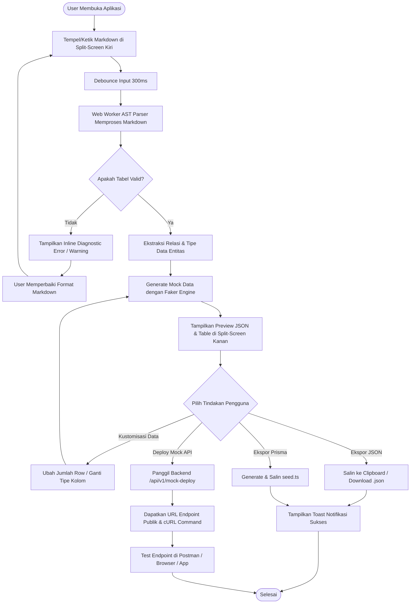

# User Flow: Mock Data Generator

## 1. Overview
Dokumen ini menggambarkan alur perjalanan pengguna (*user journeys*) saat berinteraksi dengan Mock Data Generator, mencakup alur utama (*primary flow*), konfigurasi kustom (*secondary flow*), penanganan galat (*error/exception flow*), dan alur publikasi API instan.

---

## 2. Primary & Secondary User Flow Diagram

---

## 3. Step-by-Step Flow Specifications

### 3.1. Flow 1: Quick Generate & Copy (Fast-Path)
1. **Pemicu (Trigger):** User menyalin dokumen PRD/TSD berformat Markdown dari Notion/Jira.
2. **Langkah 1:** User menempelkan teks ke panel editor sebelah kiri (*Split-Screen Layout*).
3. **Langkah 2:** Parser AST membaca struktur tabel secara instan (< 1 detik).
4. **Langkah 3:** Sisi kanan secara *real-time* menampilkan data JSON yang relevan.
5. **Langkah 4:** User menekan tombol **"Copy JSON"** atau **"Download JSON"**.
6. **Keluaran:** Clipboard terisi array JSON siap pakai untuk frontend/mocking.

### 3.2. Flow 2: Prisma Seeder Generation
1. **Langkah 1:** Setelah tabel entitas ter-render di panel kanan, user memilih tab **"Prisma Seeder"**.
2. **Langkah 2:** Sistem mengonversi struktur entitas dan data JSON menjadi format *seeder script* TypeScript (`prisma.<entity>.createMany()`).
3. **Langkah 3:** User menekan tombol **"Copy Seed Script"** atau mengunduh file `seed.ts`.
4. **Langkah 4:** User meletakkan file ke dalam folder `prisma/seed.ts` di proyek lokalnya.

### 3.3. Flow 3: Deploy Instant REST/GraphQL Mock Endpoint
1. **Langkah 1:** User mengklik tombol **"Deploy Mock API"** pada toolbar atas.
2. **Langkah 2:** Modal dialog muncul menampilkan pilihan format: `REST (GET/POST)` atau `GraphQL`.
3. **Langkah 3:** Sistem menyimpan snapshot schema/payload ke Edge KV dengan TTL 24 jam.
4. **Langkah 4:** Sistem menyajikan URL unik: `https://mockdown.dev/api/mock/abc-123-xyz` beserta contoh perintah `curl`.
5. **Langkah 5:** User langsung menggunakan URL tersebut sebagai base URL API di aplikasi frontend (React/Svelte/Vue).
